# 万字剖析muduo高性能网络库设计细节

Muduo 是一个由陈硕大神开发的 Linux 服务器端高性能网络库。网络库核心框架采用multi-reactor模型，并且遵循one loop per thread的设计理念，本项目对muduo库核心部分进行重构，采用c++11的特性，移除muduo对boost库的依赖。

我会先从整体的角度对muduo库设计进行阐述，再深入细节，对每个模块的架构，设计思想，各模块协助流程，编程细节进行深入解析。

本人出于个人学习的目的写下这篇文章，如有讲解错误的地方，欢迎提出，一起交流，下面进入正题。

---

## 📚 目录
- [一、前置知识](#一前置知识)
  - [1.1 阻塞/非阻塞 与 同步/异步](#11-阻塞非阻塞-与-同步异步)
      - [系统调用层面](#1-io系统调用层面)
      - [应用层面](#2-应用层面)
  - [1.2 五种IO模型](#12-五种IO模型)
      - [阻塞IO](#🟢阻塞IO)
      - [非阻塞IO](#🟢非阻塞IO)
      - [IO多路复用](#🟢IO-多路复用)
        - [Select](#🟡select)
        - [Poll](#🟡poll)
        - [epoll](#🟡epoll)
      - [信号驱动](#🟢信号驱动)
      - [异步](#🟢异步)
- [二、muduo库概述](#二muduo库概述)
  - [2.1 Reactor模型](#21-reactor模型)
  - [2.2 muduo库核心架构](#22-muduo库核心架构)
- [三、辅助模块](#三辅助模块)
  - [3.1 noncopyable](#31-noncopyable)
  - [3.2 Logger日志模块](#32-logger-日志模块)
  - [3.3 buffer缓冲区](#33-buffer-缓冲区)  
- [四、multi-Reactor事件循环模块](#四multi-reactor事件循环模块)
  - [4.1 Channel 类](#41-channel-类)
  - [4.2 Poller](#42-poller)
  - [4.3 EpollPoller](#43-epollpoller)
  - [4.4 EventLoop](#44-eventloop)
- [五、线程池模块](#五线程池模块)
  - [5.1 Thread类](#51-thread类)
  - [5.2 EventLoopThread](#52-eventloopthread类)
  - [5.3 EventLoopThreadPool线程池](#53-eventloopthreadpool线程池)
  - [5.4 流程](#54-流程)
- [六、Tcp通信模块](#六tcp通信模块)
  - [6.1 Tcpconnection](#61-tcpconnection)
  - [6.2 Tcpserver](#62-tcpserver)
- [七、模块间通信](#七模块间通信)
- [八、工作流程](#八工作流程)
- [九、总结](#九总结)
- [参考](#参考文章)

## 一、前置知识

在对muduo库进行正式剖析之前，先聊一聊网络编程中一些重要的基本概念。

### 1.1 阻塞/非阻塞 与 同步/异步

`阻塞/非阻塞` 和 `同步/异步` 是两个不同维度的概念，我们分别在系统调用和应用层面上进行讨论：

---

### 1. IO系统调用层面

可以说正是因为底层 I/O 系统调用的行为（如`read`, `write`）存在这两种维度，才构成了上层进程通信模型的不同概念

#### - 🟢**Blocking vs Non-blocking**

描述的是**单个系统调用是否会使进程挂起**，以下以 `read()` 为例：

- **Blocking I/O**：  
  当调用 `read()` 后，如果内核缓冲区没有数据，内核会让该进程从「运行态」进入「睡眠态」。CPU 会调度执行其他进程。直到数据准备好并被复制到用户空间缓冲区后，内核才会唤醒该进程，`read()` 调用才会返回。这个过程中，进程是被阻塞的。

- **Non-blocking I/O**：  
  通过设置文件描述符的 `O_NONBLOCK` 标志实现。当用户进程调用 `read()` 时，如果内核缓冲区没有数据，系统调用会立即返回错误码。进程不会被阻塞，可以继续执行其他代码。通常用户会通过轮询方式在稍后再次尝试调用 `read()`。

#### -🟢**Synchronous vs Asynchronous**

描述的是**整个 I/O 操作（从发起请求到数据最终可用）是由谁来完成的**，以及结果是如何被通知给进程的。

- **Synchronous I/O**：  
  在同步 I/O 中，用户进程是发起 I/O 操作的主体，并且需要主动等待或查询 I/O 操作的结果。
  
  **🌟🌟在处理 IO 的时候，阻塞和非阻塞都是同步 IO。只有使用了特殊的 API 才是异步 IO🌟🌟** 
  - 阻塞 I/O 是同步的，因为进程通过阻塞来“等待”结果。
  - 非阻塞 I/O 也是同步的，因为进程需要通过反复轮询（polling）来“查询”操作是否完成。
  - I/O 多路复用（如 `select`, `epoll`）同样是同步的。虽然它们可以同时监听多个文件描述符，看起来像“异步”，但本质上 `select/epoll` 调用会阻塞进程以“等待”事件就绪。而且当事件返回后，数据还在内核缓冲区，用户进程仍需调用 `read()` 才能完成数据读取。因此整个 I/O 操作仍然是由用户主动完成的。

- **Asynchronous I/O**：  
  异步 I/O（如 `aio_read()`）中，用户进程发起请求后立即返回，可以做其他事。  
  内核会独立完成两个阶段：

  1. 等待数据准备好；
  2. 将数据从内核缓冲区拷贝到用户指定缓冲区。

  当这两个阶段完成后，内核通过 **信号** 或 **回调函数** 的方式通知用户进程：**数据已准备完毕且拷贝完成**。
  
  也就是说在异步io中，数据的读写是由内核帮助用户完成的。

---

### 2. 应用层面

在应用层面，这些概念更多地关注程序如何组织逻辑、等待结果、以及响应 I/O 的方式。

#### - 🟢**Blocking vs Non-blocking**

当你调用某个函数（通常是 I/O 相关，比如读取 socket、发请求等）时，当前线程是否被挂起等待结果返回。

*   **Blocking I/O**：
    当应用程序执行一个操作（比如调用一个函数去获取远程 API 数据，或查询数据库）时，如果该操作需要一些时间来完成，应用程序的当前执行线程会等待该操作返回结果后才能继续执行后续代码。
    如果某个任务耗时较长，整个应用（或至少是该线程）会显得 "卡顿" 或无响应。

    **例子**：一个传统的单线程 Web 服务器，当它为一个请求查询数据库时，它必须等待数据库返回结果，在此期间无法处理其他新的请求。

*   **Non-blocking I/O**：
    当应用程序执行一个操作时，该操作会立即返回，而不会等待其真正完成。应用程序可以继续执行其他任务。
    应用程序不会因为等待某个操作而被挂起，通常需要一种机制来稍后获取操作的结果，比如通过轮询检查状态，或者注册一个回调函数。

#### - 🟢**Synchronous vs Asynchronous**

在应用层面的同步和异步更多是描述 **整个操作或者业务逻辑的完成过程，是由调用方主动去完成，还是系统或框架异步地帮你完成后，通知你结果**。

*   **Synchronous I/O**：
    整个流程是顺序的，即使底层使用了非阻塞 I/O，如果应用逻辑设计成 "发起 -> 等待结果 -> 处理结果" 的串行模式，那么从应用行为上看它仍然是同步的。

*   **Asynchronous I/O**：
    在应用层面的一个处理逻辑，比如 A 向 B 请求调用一个网络 I/O 接口时（或者调用某个业务逻辑 API 接口时），向 B 传入请求的事件以及事件发生时通知的方式，A 就可以处理其它逻辑了。
    当 B 监听到事件处理完成后，会用事先约定好的通知方式，通知 A 处理结果。

    基于 reactor 的高性能网络框架多是采用这样的非阻塞 + 异步的设计模式，开发者注册相应事件和对应事件发生的回调函数，在监听到相应事件发生时，网络框架主动调用回调函数。
    虽然在网络库内部的事件监听和 I/O 读写操作时，采用的系统接口比如 `epoll_wait` 和 `recv()` 等等仍是同步的过程，但在上层应用层面的事件注册和处理逻辑是在异步执行。

---

### 1.2 五种IO模型

---

#### 🟢**阻塞IO**
在所示的这样一个传统的socket流程中，服务器端代码阻塞在了accept()和read()两个函数上
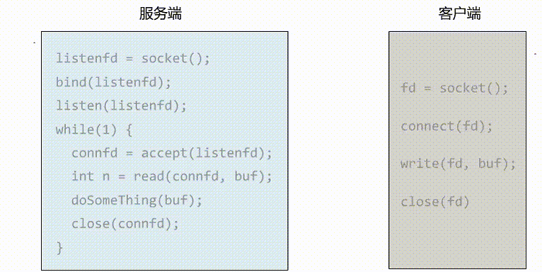

再看read()函数阻塞的内部流程,其实发生了两次阻塞

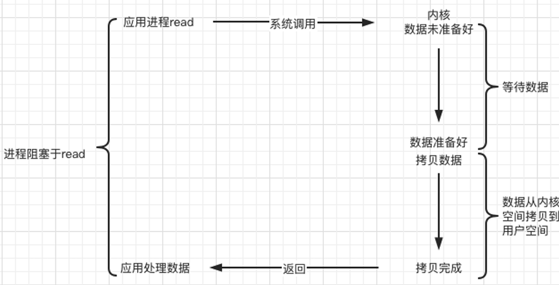
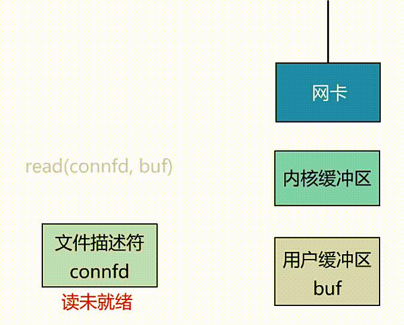

这种模式有相当大的弊端，如果对端一直不发数据，那么服务端线程将会一直阻塞在 read 函数上死等，无法进行任何其他的操作。

---

#### 🟢**非阻塞IO**
非阻塞模式是通过操作系统提供的api，将文件描述符设置为非阻塞状态，比如：
```cpp
fcntl(connfd, F_SETFL, O_NONBLOCK);
int n = read(connfd, buffer) != SUCCESS);
```
这种状态下的read函数在调用够后会直接返回，不管数据是否准备号，用户通过返回值的不同类型来自行判断，通常用户层面采用反复调用的方式来配合调用，如图：

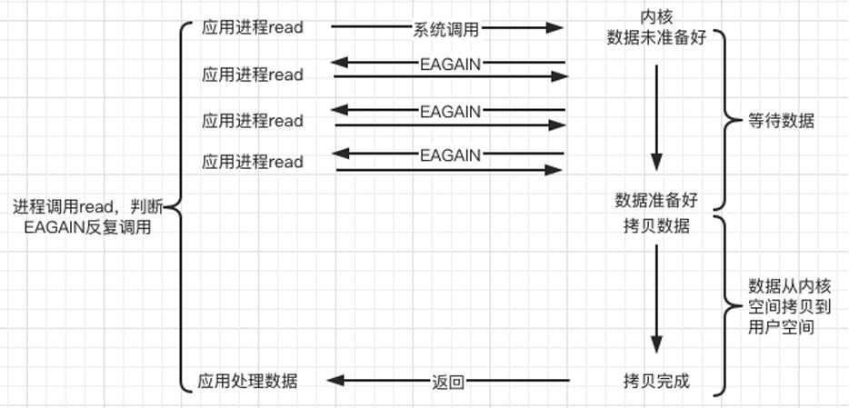


可以看到这种系统调用不会挂住程序，避免线程阻塞。

但是这里要注意，在数据还未到达网卡，或者到达网卡但还没有拷贝到内核缓冲区之前，这个阶段是非阻塞的。当数据已到达内核缓冲区，**此时调用 read 函数仍然是阻塞的**，需要等待数据从内核缓冲区拷贝到用户缓冲区，才能返回。

非阻塞 I/O 本身不是缺点，但是单纯的非阻塞 I/O 上需要搭配反复轮询去资源是否就绪，就会造成CPU空转，造成资源浪费，可以认为是非阻塞 I/O 的一种使用方式上的缺陷。

---
#### 🟢**IO 多路复用**
前面两种情况都是一次监听一个文件描述符，而IO多路复用就是：

**🌟同时监听多个文件描述符，并在有一个或多个就绪（可读/可写/异常）时，通知用户进行处理的机制🌟**
  #### - 🟡**select**
  select 是操作系统提供的系统调用函数，通过它，我们可以把一个文件描述符的数组发给操作系统， 让操作系统去遍历，确定哪个文件描述符可以读写， 然后告诉我们去处理：

  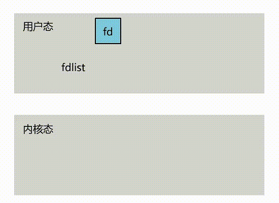

  通常采用select设计如下：
  ```cpp
  //一个线程不断接受客户端连接，并把 socket 文件描述符放到一个 list 里
  while(1) {
  connfd = accept(listenfd);
  fcntl(connfd, F_SETFL, O_NONBLOCK);
  fdlist.add(connfd);
  }

  //然后另起一个线程调用 select，将这批文件描述符 list 交给操作系统去遍历
  while(1) {
  /*
  把一堆文件描述符 list 传给 select 函数
  有已就绪的文件描述符就返回，nready 表示有多少个就绪的
  */
  nready = select(list);
  ...
  ...
  }
  ```
  但是在select返回后，操作系统会将准备就绪的文件描述符做上标识，用户其实还需要自己对文件描述符数组进行遍历，来找到有事件发生的fd。

  select有几个细节：
  1. select 调用需要传入 fd 数组，需要拷贝一份到内核，高并发场景下这样的拷贝消耗的资源是惊人的
  2. select 在内核层仍然是通过遍历的方式检查文件描述符的就绪状态，是个同步过程，只不过无系统调用切换上下文的开销，当连接数量很多时，这个轮询的成本变成 O(n)
   
  3. select 仅仅返回可读文件描述符的个数，具体哪个可读还是要用户自己遍历。（可优化为只返回给用户就绪的文件描述符，无需用户做无效的遍历）

  #### - 🟡**poll**
  poll对select进行了优化，除去了 select 只能监听 1024 个文件描述符的限制

  #### - 🟡**epoll**

  最后的epoll针对上述select中提到的几个细节进行了优化：
  1. 文件描述符集合采用红黑树的结构保存在内核中，无需用户每次都重新传入，只需告诉内核修改的部分即可
  2. 内核不再通过轮询的方式找到就绪的文件描述符，而是通过异步 IO 事件唤醒
  3. 内核仅会将有 IO 事件的文件描述符返回给用户，用户也无需遍历整个文件描述符集合 
  
  #### **🌟`epoll`的机制：基于`事件驱动+回调`🌟**
  
  通常epoll的三步使用流程是：
  1. 注册事件，只需要注册一次，通过epoll_ctl()向存在内核的epoll红黑树上挂fd和对应的回调函数指针
  ```cpp
  //告诉内核：“我关心哪个 fd 上的哪个事件，比如 EPOLLIN（可读）。”
  epoll_ctl(epfd, EPOLL_CTL_ADD, fd, &event);
  ```
  2. 等待事件就绪（阻塞状态） 
  
  内核会在你注册的 fd 上监听事件,一旦有事件发生，会立即“唤醒”你。
  ```cpp
  int n = epoll_wait(epfd, events, MAX_EVENTS, timeout);
  ```
  3. 只处理就绪 fd

  所以epoll不再对fd进行轮询

  - epoll 内核里使用了红黑树 + 就绪链表来管理监听 fd；
  - 当你调用 epoll_ctl 注册 fd 时，fd 被挂到内核维护的数据结构中；
  - 当某个 fd 状态变化（如收到数据），内核通过中断或回调直接把这个 fd 放入就绪列表；
  - epoll_wait 在睡眠中被内核事件驱动唤醒，只返回已经就绪的 fd。

  ✅ 你监听了 10000 个连接，如果只 3 个就绪，epoll_wait 只返回那 3 个，无需你自己轮询。

  过程如下：

  

---


所以在io多路复用中，整体的流程是这样的：

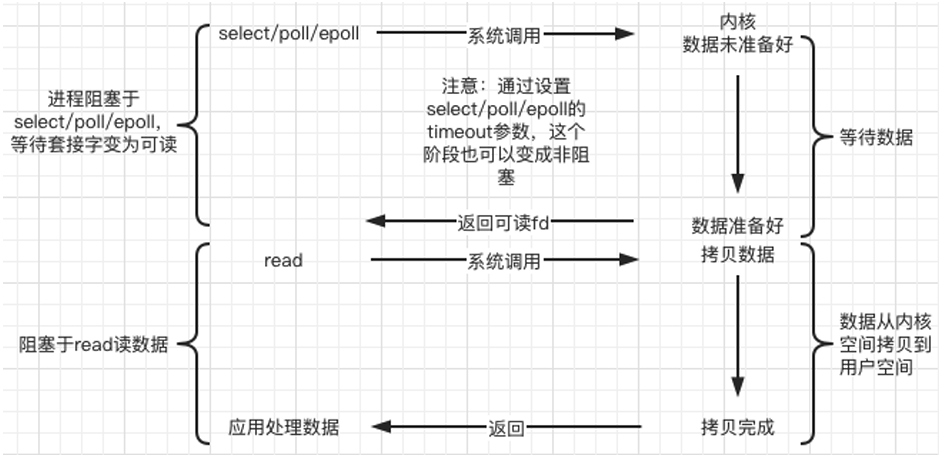

---

####  🟢**信号驱动**

信号驱动的核心思想是：

**利用内核信号机制，在 I/O 就绪时发送一个信号通知进程，然后再由进程读取数据。**
换句话说就是
* 程序不需要一直轮询检查 fd 是否可读，
* 而是内核主动 发一个 SIGIO 信号，通知你：“数据来了”，
* 程序在信号处理函数中再去调用 read() 等函数进行读写操作。

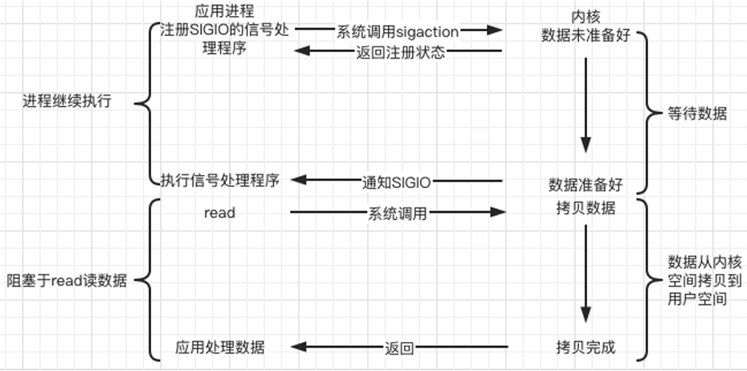

内核在第一个阶段是异步的，第二个阶段是同步的；与非阻塞IO的区别在于它提供了消息通知机制，不需要用户进程不断的轮询检查，减少了系统API的调用次数，提高了效率

---

####  🟢**异步**
应用程序发起 I/O 请求后，立即返回，不需要等待内核完成操作；当内核完成 I/O 操作后，主动通知应用程序（比如通过回调或信号），并附带读/写的结果。

 与非阻塞 I/O 不同：非阻塞 I/O 仍然要自己调用 read()/write()，而 AIO 是由内核完成操作并返回结果，真正的“交给内核全权处理”

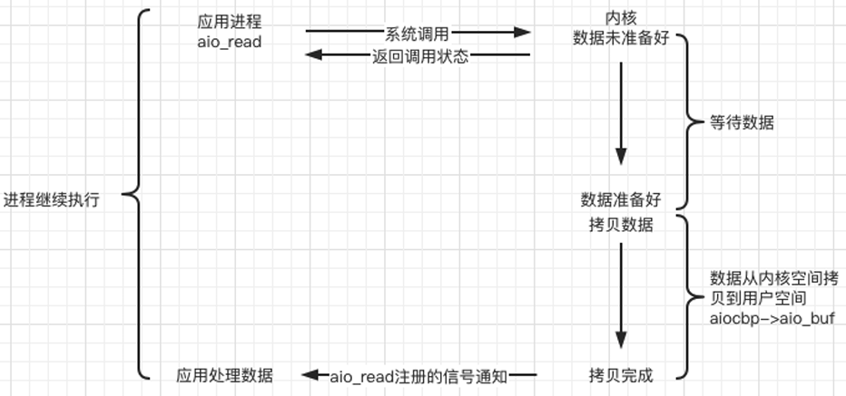

像nginx，Netty底层采用的就是操作系统提供的异步io接口实现的网络库

---

<p align="right"><a href="#万字剖析muduo高性能网络库设计细节">回到顶部⬆️</a></p>

## 二、muduo库概述

### 2.1 reactor模型

reactor是这样一种模式，它要求主线程只负责监听fd上是否有事件发生，有事件发生时就通知工作子线程来处理，而主线程只做监听，其他什么都不做，接收新的连接，处理请求，读写数据都在工作线程中完成。

---

假设一个简单的 HTTP GET 请求处理流程：

*   服务器已启动，主线程创建了 `epoll` 实例 (`epoll_fd`)。
*   一个客户端已连接到服务器，服务器接受连接后得到一个客户端套接字文件描述符 `client_socket_fd`。

🟢步骤 1： 主线程注册读就绪事件

主线程往 `epoll` 内核事件表中注册 `client_socket_fd` 上的读就绪事件。

*   **动作**：主线程调用 `epoll_ctl(epoll_fd, EPOLL_CTL_ADD, client_socket_fd, {events: EPOLLIN})`。
*   **目的**：告诉内核：“请帮我监听 `client_socket_fd`，如果它的内核接收缓冲区里有数据了（即客户端发数据过来了），就通知我。”

🟢步骤 2： 主线程等待事件

主线程调用 `epoll_wait` 等待 `client_socket_fd` (或其他已注册的fd)上有事件发生。

*   **动作**：主线程调用 `epoll_wait(epoll_fd, &events, max_events, timeout)`。此时主线程会阻塞（或在超时后返回）。
*   **例子**：服务器现在空闲，等待客户端发送 HTTP 请求。

🟢步骤 3：读就绪事件发生，主线程分发任务

当 `client_socket_fd` 上有数据可读时，`epoll_wait` 通知主线程。主线程则将 `client_socket_fd` 可读事件放入请求队列。

*   **客户端行为**：客户端发送一个 HTTP GET 请求，例如：
    ```
    GET /hello HTTP/1.1
    Host: example.com
    Connection: keep-alive
    User-Agent: Mozilla/5.0 ...

    ```
*   **内核行为**：这段数据到达服务器内核，被放入 `client_socket_fd` 的接收缓冲区。
*   **`epoll_wait` 返回**：由于 `client_socket_fd` 的接收缓冲区不再为空（发生了**读就绪事件** `EPOLLIN`），`epoll_wait` 从阻塞状态返回，并告诉主线程 `client_socket_fd` 现在可读。
*   **主线程动作**：主线程将一个表示“`client_socket_fd` 可读”的任务（例如一个包含 `client_socket_fd` 和事件类型 `EPOLLIN` 的结构体）放入一个共享的请求队列中。

🟢步骤 4：工作线程处理读事件及业务逻辑，并注册写事件

睡眠在请求队列上的某个工作线程被唤醒，它从 `client_socket_fd` 读取数据，处理客户请求，然后往 `epoll` 内核事件表中注册该 `client_socket_fd` 上的写就绪事件。

*   **工作线程动作 (读取)**：一个空闲的工作线程从请求队列中取出任务，发现是 `client_socket_fd` 的读事件。它调用 `recv(client_socket_fd, buffer, buffer_size, 0)`。
    *   **例子**：`buffer` 中现在读入了客户端发送的 HTTP 请求数据。
*   **工作线程动作 (处理)**：工作线程解析 HTTP 请求。假设它确定要返回一个简单的 "Hello World" 响应。它准备好了响应数据：
    ```
    HTTP/1.1 200 OK
    Content-Type: text/plain
    Content-Length: 12

    Hello World!
    ```
*   **工作线程动作 (注册写事件)**：现在工作线程有数据要发送回客户端了。它需要确保 `client_socket_fd` 的内核发送缓冲区有空间。所以它调用 `epoll_ctl(epoll_fd, EPOLL_CTL_MOD, client_socket_fd, {events: EPOLLIN | EPOLLOUT})` (修改监听事件，在原来的 `EPOLLIN` 基础上增加 `EPOLLOUT`。如果此时不再关心客户端是否会立即发送更多数据，也可以只设置为 `EPOLLOUT`)。
*   **目的**：告诉内核：“请帮我监听 `client_socket_fd`，如果它的内核发送缓冲区有足够空间可以让我写入数据了，就通知主线程。”

🟢步骤 5：主线程再次等待事件

主线程（可能在处理完其他事件后再次）调用 `epoll_wait` 等待 `client_socket_fd` (或其他fd)可写。

*   **动作**：主线程调用 `epoll_wait(epoll_fd, ...)`。
*   **注意**：此时 `epoll_wait` 也会继续监听其他已注册 fd 上的读/写事件。

🟢步骤 6：写就绪事件发生，主线程分发任务

当 `client_socket_fd` 可写时，`epoll_wait` 通知主线程。主线程将 `client_socket_fd` 可写事件放入请求队列。

*   **内核行为**：通常情况下，socket 的发送缓冲区在大部分时间都是有可用空间的（除非网络非常拥堵，或者对端接收非常慢，导致发送缓冲区被填满）。所以，很可能在工作线程注册 `EPOLLOUT` 后，`client_socket_fd` 立刻就是可写的。
*   **`epoll_wait` 返回**：`epoll_wait` 检测到 `client_socket_fd` 的发送缓冲区有空间（发生了**写就绪事件** `EPOLLOUT`），于是返回，并通知主线程 `client_socket_fd` 现在可写。
*   **主线程动作**：主线程将一个表示“`client_socket_fd` 可写”的任务放入请求队列。

🟢步骤 7：工作线程处理写事件

睡眠在请求队列上的某个工作线程被唤醒，它往 `client_socket_fd` 上写入服务器处理客户请求的结果。

*   **工作线程动作 (写入)**：一个工作线程（可能是同一个，也可能是另一个）从请求队列中取出任务，发现是 `client_socket_fd` 的写事件。它调用 `send(client_socket_fd, response_data, strlen(response_data), 0)`。

*   **后续**：发送完数据后，如果工作线程没有更多数据要立即发送给这个客户端（例如，响应已经完整发送），它通常会通过 `epoll_ctl` 修改 `client_socket_fd` 的监听事件，移除 `EPOLLOUT`，以避免 `epoll_wait` 因为发送缓冲区持续可写而不断触发不必要的写就绪通知（这被称为 "busy-looping" 或 "level-triggered storm"）。它可能会重新只监听 `EPOLLIN`，等待客户端的下一个请求（如果连接是持久的，如 HTTP Keep-Alive）。如果是一次性短连接，可能会准备关闭连接。

---

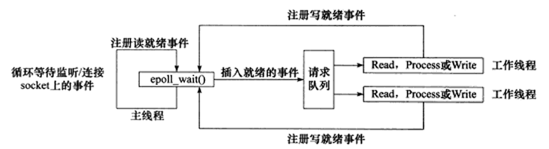

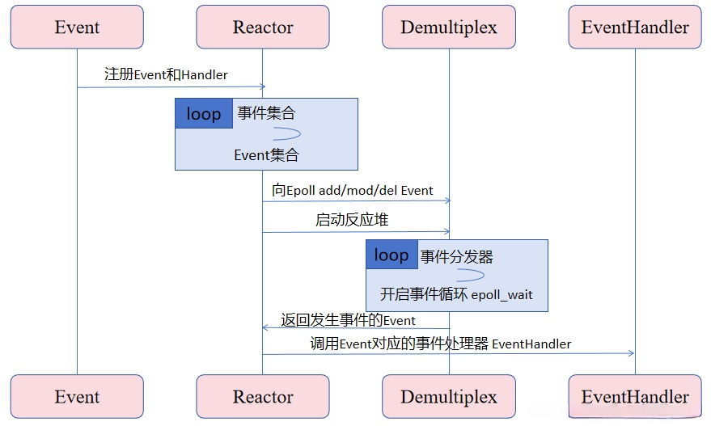

---

### 2.2 muduo库核心架构

Muduo 的核心设计采用multi-reactor模型， 是`one loop per thread + thread pool 的 Reactor 变体`

1. **主 Reactor(base-loop)**
  - 当一个Tcp服务（TcpServer）启动后，并且创建一个base-loop和一个线程池管理sub-loop
  - 主 Reactor运行在主线程中，拥有一个 baseLoop。
  - 它的核心职责是监听新的客户端连接请求 (通过 Acceptor 组件)，和分配新连接。
  - 当有新的连接到达时，主 Reactor 接受 (accept) 这个连接。
  - 主 Reactor 在接受新连接后，并不会自己处理这个连接上的后续 I/O 事件（如读写数据）。
  - 主 Reactor 会将这个新创建的连接（TcpConnection 对象）分发给一个从 Reactor。分发策略可以是轮询或其他负载均衡算法。
  
2. **从 Reactors (sub-loop)**

  - 通常由一个线程池管理，每个线程拥有唯一一个属于自己的EventLoop（one loop per thread）
  - 子loop的数量通常是根据内核数量分配
  - 一旦一个 TcpConnection 被分配给了一个特定的从 Reactor，那么该连接上的所有后续 I/O 事件（数据可读、可写、连接关闭等）都将由这个从 Reactor 在其所属的 I/O 线程中处理。


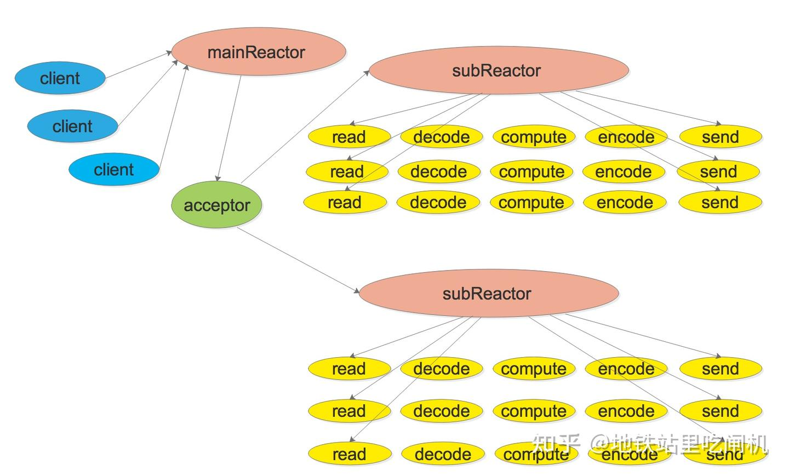


我主要将muduo库分为四大模块：


- **📌辅助模块**
- **📌multi-Reactor事件循环模块**
- **📌线程池模块**
- **📌Tcp通信模块**


在深入muduo库源码时，会发现里面有相当灵活且复杂的回调机制，在不同类不同模块之间传递，这使得muduo库中各个模块充分解耦，职责分明，但相互之间又紧密协同，只有理清各个模块的架构和工作过程，才能真正一探muduo库的设计思想。

<p align="right"><a href="#万字剖析muduo高性能网络库设计细节">回到顶部⬆️</a></p>

## 三、辅助模块

### 3.1 noncopyable

直接继承这样一个抽象的禁止拷贝和赋值基类，减少重复书写
- 构造和析构设计为protected，使基类无法被直接实例化，但允许派生类正常构造和析构
```cpp
class noncopyable{
public:
    noncopyable(const noncopyable&)=delete;
    noncopyable& operator=(const noncopyable&)=delete;
protected:
    noncopyable()=default;
    ~noncopyable()=default;
};
```
---

### 3.2 Logger 日志模块

定义了四种日志级别：
- INFO：普通日志输出
- ERROR：记录不影响程序运行的错误
- FATAL：记录重要错误，程序会因此退出
- DEBUG：调试信息，仅在调试模式下生效
```cpp
enum LogLevel{
    INFO,
    ERROR,
    FATAL,
    DEBUG,
};
```
- Logger类结构如下：
```cpp
class Logger : noncopyable{
public:
    static Logger& instance();
    void setLogLevel(int level);
    void Log(std::string);
private:
    Logger()=default;
    int LogLevel_{};
};
```
- `static Logger& instance():`
```cpp
Logger& Logger::instance(){
    static Logger Logger;
    return Logger;
}
```
获取 Logger 单例,使用静态局部变量确保只创建一个实例
- `void setLogLevel(int level):`
```cpp
void Logger::setLogLevel(int level){
    LogLevel_=level;
}
```
公用接口，用于设置当前日志实例的日志级别。每次调用日志宏时，都会先调用此方法设置对应的级别。

- `void Log(std::string msg):`
```cpp
void Logger::Log(std::string msg){
    // 根据 LogLevel_ 输出级别前缀
    switch (LogLevel_)
    {
    case INFO:  std::cout<<"[INFO]";  break;
    case ERROR: std::cout<<"[ERROR]"; break;
    case FATAL: std::cout<<"[FATAL]"; break;
    case DEBUG: std::cout<<"[DEBUG]"; break;
    default: break;
    }
    // 打印实际消息和时间戳
    std::cout << msg;
    std::cout << ":" << Timestamp::now().toString() << std::endl;
}
```

这是实际执行日志输出的方法。它会根据当前设置的 LogLevel_ 输出对应的级别标签（如 [INFO]），然后输出用户提供的消息和时间戳。

- `日志宏 (LOG_INFO, LOG_ERROR, LOG_FATAL, LOG_DEBUG): 这些宏是用户与日志系统交互的主要方式。以 LOG_INFO 为例：`

```cpp
#define LOG_INFO(logmsgFormat, ...) \
    do{ \
        Logger &logger = Logger::instance(); \       // 1. 获取 Logger 单例
        logger.setLogLevel(INFO); \                 // 2. 设置当前日志级别为 INFO
        char buf[1024]={}; \                       // 3. 创建一个缓冲区
        snprintf(buf,1024,logmsgFormat,##__VA_ARGS__); \ // 4. 使用 snprintf 格式化日志消息
        logger.Log(buf); \                          // 5. 调用 Log 方法输出
    }while(0)
```

---

### 3.3 Buffer 缓冲区
这个类的设计是提供一个灵活且高效的内存缓冲区，在tcp连接中收发消息提供一个灵活的缓冲区

设计结构如下：
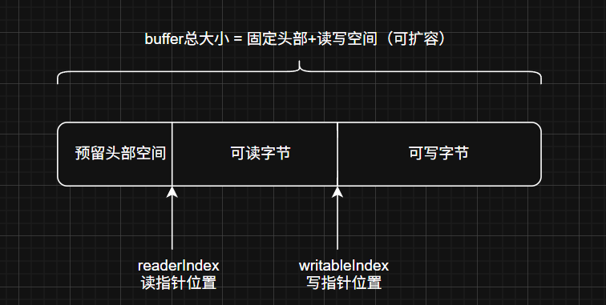

这个缓冲区在概念上被划分为三个主要部分：

1. 头部预留字节（8字节）
   - 这是缓冲区开头预留的一块空间
   - 主要目的是让你能够高效地在现有内容之前添加数据。这在网络协议中非常常见，比如你可能收到了数据负载，然后需要在前面加上长度字段或协议头
   - KCheapPrepend 常量定义了这个区域的初始大小
2. 可读字节空间
   - 这是缓冲区中实际存储的、准备好被读取或处理的数据
   - readerIndex_ 指向这部分数据的开始
   - writeIndex_ 指向这部分数据的结束，同时也是可写字节空间的开始位置
   - 如果读空间有数据，那么下一次写入数据将是紧接着数据末尾
3. 可写字节空间（从 writeIndex_ 到 buffer_.size() - 1）
   - 这是缓冲区末尾的空闲空间，新数据被写入到这个位置
   - writeIndex_ 指向这个区域的开始

- `一些功能性的对外接口`
```cpp
// 返回可读字节数（写指针 - 读指针）
    size_t readableBytes() const {
        return writeIndex_ - readerIndex_;
    }

    // 返回可写字节数（缓冲区总大小 - 写指针）
    size_t writableBytes() const {
        return buffer_.size() - writeIndex_;
    }

    // 返回前置空间的大小（读指针之前的区域,包含头部）
    size_t prependableBytes() const {
        return readerIndex_;
    }

    char* beginWrite(){
        return begin() + writeIndex_;
    }
    const char* beginWrite() const {
        return begin() + writeIndex_;
    }
```
- `读取数据`
```cpp
    const char* peek() const {
        return begin() + readerIndex_;
    }

    // 读取所有可读数据并以 std::string 返回，同时清空缓冲区
    std::string retrieveAllAsString() {
        return retrieveAsString(readableBytes());
    }

    // 读取 len 长度的数据并返回为 string，同时推进读指针
    std::string retrieveAsString(size_t len) {
        std::string result(peek(), len); // 从 peek 开始复制 len 字节
        retrieve(len);                   // 读取后移动读指针
        return result;
    }

        // 读取 len 长度的数据，相当于向前推进 readerIndex_
    void retrieve(size_t len) {
        if (len < readableBytes()) {
            // 只推进部分读指针
            readerIndex_ += len;
        } else {
            // 如果要读的长度超过了可读数据，则全部清空
            retrieveAll();
        }
    }

    // 清空所有数据，重置读写指针
    void retrieveAll() {
        readerIndex_ = writeIndex_ = KCheapPrepend;
    }
```
- `扩容思路和方法`
```cpp
    
    void append(const char *data,size_t len){
        ensureWriteableBytes(len);
        std::copy(data,data+len,beginWrite());
        writeIndex_ += len;
    }

    void ensureWriteableBytes(size_t len){
        if(writableBytes()<len){
            makeSpace(len);
        }
    }
    void makeSpace(size_t len){
    if(writableBytes()+prependableBytes() < len + KCheapPrepend){
        buffer_.resize(writeIndex_+len);
    }else{
        size_t readable = readableBytes();
        std::copy(begin() + readerIndex_, begin()+writeIndex_, begin()+KCheapPrepend);
        readerIndex_=KCheapPrepend;
        writeIndex_= readerIndex_+readable;
      }
    }
```
在每次插入数据之前，调用ensureWriteableBytes接口确保buffer缓冲区有足够的写入空间，如果不够，就调用makeSpace方法进行扩容

扩容前首先进行判断：`if(writableBytes()+prependableBytes() < len + KCheapPrepend)`
表示：可写入的空间+ read指针前的空间**是否大于**写入数据长度+len
1. `否`
   那就直接resize()开辟空间
2. `是` 
    代表：可读数据中头部有部分数据已经被读走，前面空出的空间+剩余的可写空间已经够大，就不用重新开辟
    将剩余的未读数据移动到头部，然后将可用空间拼接起来再利用，如图：
    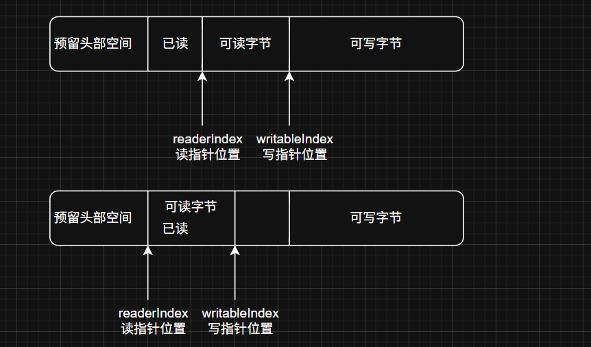

`🟢缓冲区读操作`

从一个给定的 fd 中读取数据，将其存入 Buffer 中

```cpp
    ssize_t Buffer::readFd(int fd, int* savedErrno) {
    // 在栈上创建一个临时缓冲区，大小为 65536 字节 (64KB)
    char extrabuf[65536] = {}; 

    // 定义一个 iovec 结构体数组，用于 readv 系统调用
    // iovec 结构体用于描述一块内存区域
    // readv 可以一次性从文件描述符读取数据到多个不连续的内存区域
    struct iovec vec[2];

    // 获取当前 Buffer 中可写字节数
    const size_t writable = writableBytes();

    // 设置第一个 iovec 结构体：指向 Buffer 内部的可写空间
    vec[0].iov_base = begin() + writeIndex_; // 可写区域的起始地址
    vec[0].iov_len = writable;              // 可写区域的长度

    // 设置第二个 iovec 结构体：指向栈上的临时缓冲区 extrabuf
    vec[1].iov_base = extrabuf;
    vec[1].iov_len = sizeof extrabuf;       // extrabuf 的总大小
    const int iovcnt = (writable < sizeof extrabuf) ? 2 : 1;

    // 调用 readv 系统调用从 fd 读取数据到 vec 指定的内存区域
    // readv 会先尝试填满 vec[0]，如果还有数据且iovcnt是2，再尝试填满 vec[1]
    const ssize_t n = ::readv(fd, vec, iovcnt);

    // 处理 readv 的返回值
    if (n < 0) {
        // 读取出错，保存错误码
        *savedErrno = errno;
    } else if (static_cast<size_t>(n) <= writable) {
        // 读取成功，并且所有读取到的数据都成功存入了 Buffer 内部的可写空间 (vec[0])
        // 直接增加写指针 writeIndex_
        writeIndex_ += n;
    } else {
        // 读取成功，但读取到的数据量 n 超过了 Buffer 内部初始的可写空间 writable
        // 这意味着数据一部分存入了 vec[0]，剩下的存入了 extrabuf (vec[1])
        // 首先，Buffer 内部的可写空间已全部被填满
        writeIndex_ = buffer_.size(); // 将写指针移到 Buffer 的末尾
        // 然后，将 extrabuf 中超出 writable 部分的数据追加到 Buffer 中
        // n - writable 是实际存储在 extrabuf 中的数据量
        // append 函数会负责处理 Buffer 空间的扩展
        append(extrabuf, n - writable);
    }
    return n;
}

```

**使用了 readv 和 struct iovec 结合实现一次性从文件描述符读取数据到多个不连续的内存块中**
1. 在栈上声明一个字符数组，大小为 65536 字节（64KB），用来当作缓冲区的缓冲区
2. struct iovec vec[2]
   - iovec 结构体数组，用于 readv 和 writev 系统调用，它定义了一个内存区域（内存起始地址和长度）。iovec 结构体包含两个元素：
   ```cpp
    struct iovec {
    void  *iov_base;    /* Starting address */
    size_t iov_len;     /* Number of bytes to transfer */
        };
3. 把数组第一块内存定义为buffer的写缓冲区，第二块内存设置为栈上缓冲区exterbuf
4. **🌟const int iovcnt = (writable < sizeof extrabuf) ? 2 : 1;🌟**
   - 决定 readv 调用中 iovec 数组的实际使用数量 (iovcnt)
   - 逻辑：
     - 如果 Buffer 的可写空间 writable 小于 extrabuf 的大小（64KB），那么我们同时使用 Buffer 的内部空间和 extrabuf (即 iovcnt = 2)。这样做的目的是，如果读取的数据很多，先填满 Buffer 的可写部分，多余的再放入 extrabuf。 之后再调用append把extrabuf的内容写入可写空间中，这个时候会对buffer进行一次扩容（调用makeSpace）
    
     - 如果 Buffer 的可写空间 writable 大于等于 extrabuf 的大小，那么只使用 Buffer 的内部空间 (iovcnt = 1)。因为即使 extrabuf 能提供的空间（64KB）都填满了，Buffer 自身也还有空间。**这个情况就是一次读的数据保证大于64k，但是如果这一次已经把大于64k的可写空间都填满了，那剩下的也不管了，下一次调用的时候再来读**
5. const ssize_t n = ::readv(fd, vec, iovcnt)；调用readv 读fd上的数据
   - 参数： 
        - fd: 文件描述符
        - iov: iovec 结构体数组
        - iovcnt: iov 数组的元素个数
    - 返回值：
        - 成功时返回读取的总字节数
        - 失败时返回 -1 并设置 errno
   - readv 会按照 vec 数组中元素的顺序填充数据：首先填满 vec[0] 指向的内存区域，如果还有数据且 iovcnt 大于1，则接着填满 vec[1] 指向的区域
6. 返回写入的字节数

这种设计的好处：
- 采用readv来读取数据，这样只会调用一次系统io操作，避免频繁的内核到用户的数据拷贝
- 处理大数据块：通过结合内部缓冲区和栈上的 extrabuf，读取可能超过当前 Buffer 可写容量的数据


`🟢缓冲区写操作`

就是是将 Buffer 中当前可读的数据全部写入到指定的文件描述符 fd 中
```cpp
ssize_t Buffer::writeFd(int fd,int *saveErrno){
     size_t n = ::write(fd,peek(),readableBytes());
     if(n < 0){
        *saveErrno = errno;
    }
    return n;
}
```


<p align="right"><a href="#万字剖析muduo高性能网络库设计细节">回到顶部⬆️</a></p>

## 四、multi-Reactor事件循环模块
这个模块主要由四个类构成：
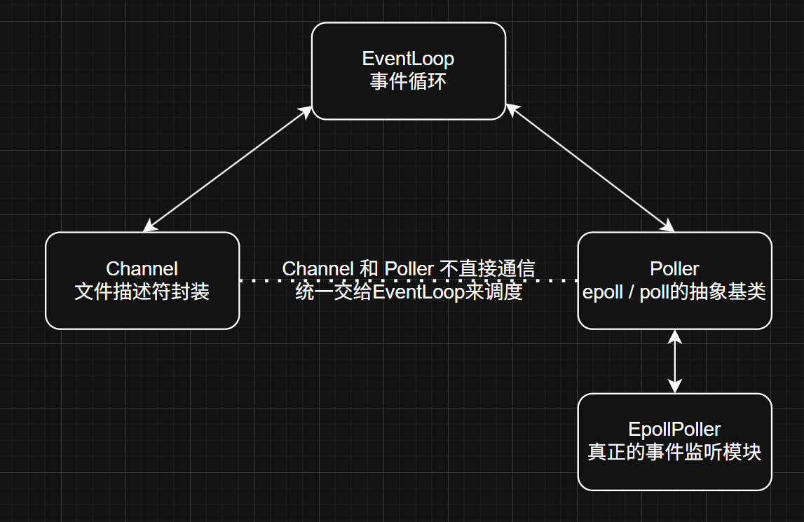

### 4.1 Channel 类
这个类用于封装一个文件描述符（如套接字、管道、定时器fd等）及其相关的事件和回调。它是事件分发的核心组件之一
**channel 类的核心职责**
1. 封装文件描述符：每个 Channel 对象都与一个唯一的文件描述符关联
2. 注册感兴趣的事件：Channel 负责告诉事件循环它关心哪些类型的事件（update到eventloop,再由eventloop提交到poller中）
3. 存储事件回调：当 Poller 检测到 fd 上发生了 Channel 感兴趣的事件时，告知eventloop，由eventloop来通知 Channel 调用预先设置好的回调函数来处理这些事件
4. 生命周期管理：将channel和eventloop绑定（weak_ptr观察eventloop对象），防止在对象销毁后仍然执行其回调。
`设置回调`
```cpp
void setReadCallback(ReadEventCallback cb){ readCallback_=std::move(cb); }
void setWriteCallback(EventCallback cb){ writeCallback_=std::move(cb); }
void setCloseCallback(EventCallback cb){ closeCallback_=std::move(cb); }
void setErrorCallback(EventCallback cb){ errorCallback_=std::move(cb); }
```
用户设置的回调最终都是绑定到channel上，并交给eventloop去做监听，回调最初的设置是在tcpserver中，在第六章讲解

`绑定`
```cpp
std::weak_ptr<void> tie_{};
void Channel::tie(const std::shared_ptr<void>&obj){
    tie_=obj;
    tied_=true;
}
```
这个 tie 机制是为了解决“悬挂回调”问题：如果 Channel 所属的对象（比如一个 TcpConnection）已经被销毁，但事件循环中仍有该 Channel 的事件待处理，直接调用回调可能会访问无效内存。tie 通过 std::weak_ptr 确保只有在宿主对象存活时才执行回调。

`注册感兴趣的事件`

```cpp

void enableReading(){events_ |= KReadEvent;   update();}
void disableReading(){events_ |= ~KReadEvent; update();}
void enableWriting(){events_ |= KWriteEvent;  update();}
void disableReading() { events_ &= ~KReadEvent; update(); }
void disableWriting() { events_ &= ~KWriteEvent; update(); }

void Channel::update(){
  loop_->updateChannel(this);
}
```
- 这些方法用于修改 Channel 感兴趣的事件集合 (events_)
- 每次修改 events_ 后，都会调用 update() 方法,update调用所属eventloop的updateChannel方法，在其中调用poller_->updateChannel(channel);

`最终的事件回调执行`

```cpp
void Channel::handleEvent(Timestamp receiveTime){
    if(tied_){
        auto ptr = tie_.lock();
        if(ptr){
            handleEventWithGuard(receiveTime);
        }
    }else{
        handleEventWithGuard(receiveTime);
    }
}

void Channel::handleEventWithGuard(Timestamp recieveTime){
    //关闭写端会触发epollhup事件
    if((revents_ & EPOLLHUP)&&!(revents_ & EPOLLIN)){
        if(closeCallback_)closeCallback_();
    }
    if(revents_ & EPOLLERR){
        if(errorCallback_)errorCallback_();
    }
    if(revents_&(EPOLLIN | EPOLLPRI)){
        if(readCallback_)readCallback_(recieveTime);
    }
    if(revents_ & EPOLLOUT){
        if(writeCallback_)writeCallback_();
    }
}
```
当 Poller 通知 EventLoop某个 fd 上有事件发生时，EventLoop 会调用对应 Channel 的这个方法,执行用户设置的回调。


### 4.2 Poller
Poller 类在 Reactor 模式中充当 I/O 多路复用的抽象基类。它的主要职责是监听一组文件描述符（通过 Channel 对象间接管理），并在这些文件描述符上发生事件时通知 EventLoop。具体的 I/O 多路复用机制（如 epoll, poll, select）由其派生类实现
```cpp
class Poller : noncopyable{
public:
    using ChannelList = std::vector<Channel*>;
    Poller(EventLoop *loop);
    virtual ~Poller();
    virtual Timestamp poll(int timeoutMs, ChannelList *activeChannels) = 0;
    virtual void updateChannel(Channel *channel) = 0;
    virtual void removeChannel(Channel *channel) = 0;

    bool hasChannel(Channel *channel)const;
    static Poller* newDefaultPoller(EventLoop *loop);
protected:
    //key：shckfd，value：sockfd所属的Channel类型
    using ChannelMap = std::unordered_map<int,Channel*>;
    //存储所有正在被 Poller 监听的 Channel
    ChannelMap listening_channels_;
private:
    EventLoop *ownerLoop_;
};
```
着重讲一下这个类的设计和静态工厂方法

1. 静态工厂方法

    `static Poller* newDefaultPoller(EventLoop *loop);`

    **工厂方法模式设计模式封装对象的创建过程，并允许在不修改客户端代码（这里是 EventLoop）的情况下改变被创建的对象类型。**

-  在初始化时需要一个 Poller 对象来处理 I/O 多路复用。但是，具体使用哪种 Poller（例如             EpollPoller、PollPoller 或 SelectPoller）eventloop不知道，也不会把判断的逻辑放在eventloop中，EventLoop 只需要一行代码:
   ```cpp
   poller_ = Poller::newDefaultPoller(this); // 'this' 是 EventLoop 实例
   ```
   newDefaultPoller 方法将这个“决定使用哪种 Poller 并创建它”的逻辑封装起来。EventLoop 只需要调用这个静态方法，就能得到一个合适的 Poller 实例，而无需关心创建内部具体细节。
- 并且在单独的文件中对newDefaultPoller做出具体的实现
  - 如果需要添加新的 Poller 类型或者修改选择逻辑时，只需要修改 Poller.cpp 中 newDefaultPoller 的实现，而 Poller.h 的接口可以保持不变。
  - 避免在基类的文件中由去包含子类的头文件，这不符合设计思想。


2. 多态
   - virtual ~Poller(); (虚析构函数)
  
        当通过基类指针 (Poller*) 指向一个派生类对象（比如 EpollPoller*），并在程序结束或不再需要该对象时 delete 这个基类指针，如果析构函数不是虚的，那么只会调用基类 Poller 的析构函数，而派生类 EpollPoller 的析构函数不会被调用。这会导致派生类中分配的资源（如 EpollPoller 可能创建的 epoll 文件描述符）无法被正确释放，从而造成资源泄漏。

   - 纯虚函数
        ```cpp
            virtual Timestamp poll(int timeoutMs, ChannelList *activeChannels) = 0;
            virtual void updateChannel(Channel *channel) = 0;
            virtual void removeChannel(Channel *channel) = 0;
        ```
        EventLoop 可以持有一个 Poller* 指针，这个指针可以指向一个 EpollPoller 对象或一个 PollPoller 对象。当 EventLoop 调用 poller->poll(...) 时，由于 poll 是虚函数，实际执行的是指针所指向的具体派生类中的 poll 实现，实现运行时多态。


### 4.3 EpollPoller
这个类是 Poller 接口的一个具体实现，通过 epoll I/O 来监听事件
```cpp
class EPollPoller : public Poller
{
public:
    //构造中进行epoll_create
    EPollPoller(EventLoop *loop);
    ~EPollPoller() override ;
    //epoll_wait操作
    Timestamp poll(int timeoutMs, ChannelList *activeChannels)override;
    //epoll_ctl操作
    void updateChannel(Channel *channel)override;
    void removeChannel(Channel *channel) override;
private:
    static const int KInitEventListSize = 16;

    void fillActiveChannels(int numEvents,ChannelList *activeChannels)const;
    void update(int operation,Channel *channel);

    using EventList = std::vector<epoll_event>;
    int epollfd_; //epoll句柄
    EventList events_;
};
```
1. **构造函数**

    创建epoll句柄
    ```cpp
    EPollPoller::EPollPoller(EventLoop *loop)
    :Poller(loop),
    epollfd_(::epoll_create1(EPOLL_CLOEXEC)),
    events_(KInitEventListSize)
    {
        if(epollfd_<0){
            LOG_FATAL("epoll_create error:%d \n",errno);
        }
    }
    ```

2. **updateChannel**

    在上面聊到channel注册感兴趣的事件时，最终的调用就会来到这个位置
    ```cpp
    void EPollPoller::updateChannel(Channel *channel){
        const int index = channel->index();
        LOG_INFO("func = %s fd=%d events=%d index=%d \n",__FUNCTION__,channel->fd(),channel->events(),index);
        if(index == KNew || index== KDeleted){
            if(index == KNew){
                int fd = channel->fd();
                listening_channels_[fd]=channel;
            }
            channel->set_index(KAdded);
            update(EPOLL_CTL_ADD,channel);
        }
        else{ //channel已经注册过
            int fd = channel->fd();
            if(channel->isNoneEvent()){
                update(EPOLL_CTL_DEL,channel);
                channel->set_index(KDeleted);
            }
            else{
                update(EPOLL_CTL_MOD,channel);
            }
        }
    }

    void EPollPoller::update(int operation,Channel *channel){

        epoll_event event;
        memset(&event,0,sizeof event);
        //bzero
        int fd = channel->fd();
        event.data.fd = fd;
        event.events = channel->events();
        event.data.ptr = channel;
        
        if(::epoll_ctl(epollfd_,operation,fd,&event)<0){
            if(operation==EPOLL_CTL_DEL){
                LOG_ERROR("epoll_ctl del error:%d\n",errno);
            }
            else{
                LOG_ERROR("epoll_ctl add/mod error:%d\n",errno);
            }
        }
    }

    ```
    1. 将从eventloop传递过来的channel存入Poller中维护的map（listening_channels_）,键值对就是 fd : channel
    2. 调用私有update函数，在其中调用epoll_ctl，真正将事件注册到内核红黑树上
    3. 在update中又将epoll_event的ptr指向channel，实现fd和channel的绑定
        ```cpp
                typedef union epoll_data
        {
        void *ptr;
        int fd;
        uint32_t u32;
        uint64_t u64;
        } epoll_data_t;

        struct epoll_event
        {
        uint32_t events;	/* Epoll events */
        epoll_data_t data;	/* User data variable */
        } __EPOLL_PACKED;
        ```

3. poll阻塞监听
这是 EPollPoller 等待I/O事件的真正调用
```cpp
Timestamp EPollPoller::poll(int timeoutMs, ChannelList *activeChannels){
    LOG_INFO("func=%s => fd total count:%zu\n",__FUNCTION__,listening_channels_.size());
    int numEvents = ::epoll_wait(epollfd_,&*events_.begin(),static_cast<int>(events_.size()),timeoutMs);
    int saveErrno = errno;
    Timestamp now(Timestamp::now());
    if(numEvents > 0){
        LOG_INFO("%d events happened\n",numEvents);
        fillActiveChannels(numEvents , activeChannels);
        //如果所有事件都触发了，就进行扩容
        if(numEvents == events_.size()){
            events_.resize(events_.size()*2);
        }
    }
    else if(numEvents == 0){
        LOG_DEBUG("%s timeout \n",__FUNCTION__);
    }
    else{
        if(saveErrno != EINTR){
            errno = saveErrno;
            LOG_ERROR("EPollPoller::poll（） error !");
        }
    }
    return now;
}
```

### 4.4 Eventloop
EventLoop 类的核心职责
1. 事件循环：运行一个循环，不断地查询（poll）是否有事件发生。
1. I/O 多路复用：通过一个 Poller 对象来监听多个文件描述符上的I/O事件。
1. 事件分发：Poller 检测到事件时，EventLoop 将事件分发给对应的 Channel 对象进行处理。
2. 执行回调任务：允许其他线程安全地将回调函数提交到 EventLoop 所在的线程中执行，以避免跨线程直接操作共享数据带来的竞态条件。
3. 线程专属：一个 EventLoop 对象对应一个线程，确保所有与该循环相关的操作都在同一个线程中执行。

**先看类设计：**
```cpp
class EventLoop : noncopyable
{
public:
    using Functor = std::function<void()>;
    EventLoop();
    ~EventLoop();
    
    void loop();//开起事件循环
    void quit();//退出事件循环

    Timestamp pollReturnTime() const{return pollReturnTime_;}
    void runInLoop(Functor cb);//在当前loop执行cb
    void queueInLoop(Functor cb);//把cb放入队列，幻想loop所在线程，执行cb

    void wakeup();//唤醒loop所在线程
    /*
        ==》调用poller的方法
    */
    void updateChannel(Channel *channel);
    void removeChannel(Channel *channel);
    bool hasChannel(Channel *Channel);
    
    bool isINLoopThread()const {return threadId_==CurrentThread::tid();}
private:

    void handleRead();//wake up
    void dopendingFunctors();//执行回调

    using ChannelList = std::vector<Channel*>;
    std::atomic_bool looping_;
    std::atomic_bool quit_;

    const pid_t threadId_;//当前loop所在的线程id
    Timestamp pollReturnTime_;//poller返回的发生时间的channels的时间点
    std::unique_ptr<Poller> poller_;

    int wakeupFd_;//当mainloop获取新的channel，轮询选择subloop,通过wakeupFd_唤醒subloop
    std::unique_ptr<Channel> wakeupChannel_;//eventloop不操作fd，统一封装为channel，wakeupChannel_封装wakeupFd_

    ChannelList activeChannels_;
    Channel *currentActiveChannel_;

    std::atomic_bool callingPendingFunctors_;//当前loop是否有需要执行的回调
    std::vector<Functor> pendingFunctors_;//储存loop所需要的所有回调操作
    std::mutex mutex_;//线程安全
};
```
🟢 **构造函数**
```cpp
EventLoop::EventLoop()
    : looping_(false)
    ,quit_(false)
    ,callingPendingFunctors_(false)
    ,threadId_(CurrentThread::tid())
    ,poller_(Poller::newDefaultPoller(this))
    ,wakeupFd_(createEventfd())
    ,wakeupChannel_(new Channel(this,wakeupFd_))
    ,currentActiveChannel_(nullptr)
{
    LOG_DEBUG("EventLoop created %p in thread %d \n",this,threadId_);
    if(t_loopInThisThread){
        LOG_FATAL("Another loop %p exists in this thread %d \n",t_loopInThisThread,threadId_);
    }
    else
    {
        t_loopInThisThread=this;
    }

    //设置wakeupfd的事件类型以及发生事件后的回调
    wakeupChannel_->setReadCallback(std::bind(&EventLoop::handleRead,this));
    //每一个eventloop都将监听wakeupchannel的EPOLLIN读事件
    wakeupChannel_->enableReading();
}

//wakeup_fd的回调
void EventLoop::handleRead()
{
    uint64_t one =1;
    ssize_t n = read(wakeupFd_,&one,sizeof one);
    if(n !=sizeof one){
        LOG_ERROR("eventloop::handleRead() reads %zd bytes instead of 8",n);
    }
}
```
初始化成员变量：
1. looping_, quit_, callingPendingFunctors_ (原子类型)：用于控制循环状态和回调执行状态
2. threadId_: 记录当前 EventLoop 对象所在的线程ID，通过 CurrentThread::tid() 获取
3. poller_: 通过 Poller::newDefaultPoller(this) 创建一个具体的 Poller 实例，eventloop中的事件监听就靠它来执行
4. **🌟wakeupFd_以及回调设置🌟**:
    **非常关键！！！！**

    **在muduo库中base-loop获得新连接要分配给sub-loop时，靠的就是这个wakeupfd_来进行通信的**

    **并且在muduo中，所有fd都统一封装为channel**

    在每个eventloop构造发生时，

    流程示例：

    假设我们有一个主 `EventLoop` (`mainLoop`) 和一个 `EventLoop` 线程池，池中有多个 `Sub EventLoop`（比如 `subLoop1`, `subLoop2`, ...）。

    

    #### 1. 主 `EventLoop` (`mainLoop`) 接收新连接：

    *   `mainLoop` 正在其 `loop()` 方法中运行，其 `Poller` 监听着 `listenfd`
    *   一个客户端发起连接请求
    *   `listenfd` 变为可读
    *   `mainLoop` 的 `Poller::poll()` 返回，`Acceptor` 的 `Channel` 被激活
    *   `mainLoop` 执行 `Acceptor` 的新连接回调函数
    *   在 `Acceptor::handleRead()` 内部：
        *   调用 `::accept()` 接受新连接，得到 `connfd` 和客户端地址
        *   **选择一个 `Sub EventLoop`**：`Acceptor` (它所属 `TcpServer` 类) 会从 `EventLoop` 线程池中按照轮询选择一个 `Sub EventLoop`，比如选中了 `subLoop1`
        *   **创建 `TcpConnection` 对象**：为这个 `connfd` 创建一个新的 `TcpConnection` 对象。这个 `TcpConnection` 对象会被关联到选中的 `subLoop1`
        *   **关键的跨线程任务**：`mainLoop` (运行在主线程) 现在需要通知 `subLoop1` (运行在另一个IO线程) 来接管这个新的 `TcpConnection`，特别是要将 `connfd` 对应的 `Channel` 注册到 `subLoop1` 的 `Poller` 中。这个注册操作**必须**在 `subLoop1` 自己的线程中执行，以保证线程安全

    #### 2. `mainLoop` 通知 `subLoop1`：

    *   `mainLoop` 调用 `subLoop1->queueInLoop(callback)`。
    *   这个 `callback` 会封装了进 `subLoop1` 线程的任务队列，为新 `TcpConnection` 设置 `Channel` 并将其注册到 `subLoop1` 的 `Poller` 中。
    *   在 `subLoop1->queueInLoop(callback)` 内部：
        *   `callback` 被添加到 `subLoop1` 的 `pendingFunctors_` 队列中（受互斥锁保护）。
        *   🌟🌟因为 `mainLoop` 调用 `queueInLoop` 时，`subLoop1->isINLoopThread()` 会返回 `false` (因为当前线程是主线程，不是 `subLoop1` 的线程)，所以会执行 `subLoop1->wakeup()`🌟🌟。

    #### 3. `subLoop1->wakeup()` 的执行：

    *   `wakeup()` 函数向 `subLoop1` 的 `wakeupFd_` (我们称之为 `subLoop1_wakeupFd`) 写入一个字节当作事件发生。
        ```cpp
        uint64_t one = 1; 
        ::write(subLoop1_wakeupFd, &one, sizeof one);
        ```

    #### 4. `subLoop1` 被唤醒：

    *   `subLoop1` 可能正阻塞在 `Poller::poll()` 调用上，监听着它所管理的channel们是否有事件发生，其中就有subLoop1_wakeupFd(在构造时就已经封装为channel，注册到poller上)。
    *   由于 `mainLoop` 向 `subLoop1_wakeupFd` 写入了数据，`subLoop1_wakeupFd` 变为可读。
    *   `subLoop1` 的 `Poller::poll()` 检测到 `subLoop1_wakeupFd` 可读，于是返回。
    *   `subLoop1` 的 `loop()` 方法会遍历 `activeChannels_`。其中一个就是 `subLoop1` 的 `wakeupChannel_` 
    *   `wakeupChannel_->ReadCallback()` 被调用，进而执行 `EventLoop::handleRead()`。
    *   `EventLoop::handleRead()` 会从 `subLoop1_wakeupFd` 中读取数据，清除读事件。

    #### 5. `subLoop1` 执行待处理任务：

    *   在 `subLoop1` 的 `loop()` 方法中，处理完I/O事件后，会调用 `dopendingFunctors()`。
    *   `dopendingFunctors()` 会从 `pendingFunctors_` 队列中取出之前由 `mainLoop` 提交的那个 `callback`。
    *   **`subLoop1` 在其自己的线程中执行 `callback`**。这个 `callback` (例如 `TcpConnection::connectEstablished`) 会：
        *   为新的 `connfd` 创建或配置一个 `Channel`。
        *   设置 `Channel` 的读写回调（指向 `TcpConnection` 的 `handleRead`, `handleWrite` 等方法）。
        *   调用 `subLoop1->updateChannel(newChannel)` 将这个新的 `Channel` 注册到 `subLoop1` 的 `Poller` 中，开始监听 `connfd` 上的读写事件。


    `wakeupFd_` 在此过程中的角色总结：

    *   **作为信使**：当主 `EventLoop` (或其他任何线程) 需要让一个特定的 `Sub EventLoop` 执行某个任务时，它会将任务放入该 `Sub EventLoop` 的队列，并向该 `Sub EventLoop` 的 `wakeupFd_` 发送一个“信号”（通过写入数据）。
    *   **打破阻塞**：这个信号使得 `Sub EventLoop` 的 `Poller::poll()` 调用从阻塞状态返回，即使当前并没有其他客户端I/O事件发生。
    *   **保证任务在目标线程执行**：唤醒 `Sub EventLoop` 后，它就能在其 `loop()` 的后续步骤中检查并执行 `pendingFunctors_` 队列里的任务，从而确保了这些任务（如注册新连接的 `Channel`）是在 `Sub EventLoop` 自己的线程中执行的，避免了跨线程直接操作 `Poller` 等共享数据可能带来的竞态条件。

🟢 **loop事件循环**

这个方法它驱动着整个事件处理机制。一旦调用 loop()，当前线程就会进入一个持续的循环，直到被明确指示退出
```cpp
void EventLoop::loop(){
    looping_ = true;
    quit_=false;
    LOG_INFO("eventloop %p start looping \n",this);

    while(!quit_){
        activeChannels_.clear();
        //poller监听两类fd，一类是来自client，一类是用于loop间通信的eventfd(统一会封装为channel)
        pollReturnTime_ = poller_->poll(KPollTimeMs,&activeChannels_);
        for(auto ch : activeChannels_)
        {
            ch->handleEvent(pollReturnTime_);
        }
        //执行当前loop循环需要处理的回调操作
        dopendingFunctors();
    }
    LOG_INFO("eventloop %p stop looping \n",this);
    looping_=false;
}
```
1. 初始化 (Initialization)：

    - `looping_ = true`: 表明事件循环正在运行。这可以被其他部分查询，了解 EventLoop 的状态。
    - `quit_ = false`: 设置退出标志为 false。这个标志控制着主 while 循环的持续。当其他地方（比如另一个线程，或者 EventLoop 自身的某个回调）想要停止这个事件循环时，会将 quit_ 设置为 true。
 2. 主循环 (while(!quit_)): 只要 quit_ 标志是 false，循环就会不断进行。每一轮循环代表一次对事件的检查和处理
    - `清理活动事件` activeChannels_.clear()
        
        activeChannels_ 是一个容器，用来存放上一轮 Poller::poll() 调用返回的、发生了I/O事件的 Channel 对象。
        在每一轮循环开始时，这个列表被清空，为当前轮次中新发生的事件做准备。
    - `这是事件循环的核心阻塞点`
        
        poller_->poll() 会调用底层的I/O多路复用机制（epoll_wait）
        
        - 监听对象：Poller 监听两类文件描述符对应的 Channel 
            
            1. 客户端连接相关的 fd: subloop监听已建立的 TCP 连接的 socket fd，用于读写客户端数据。baseloop监听新用户的连接
            1. EventLoop 内部通信的 fd: 最典型的就是 wakeupFd_ (一个 eventfd)，用于从其他线程唤醒当前 EventLoop，使其从 poll() 调用中返回，即使没有外部I/O事件。
3. *处理事件，有两类事件回调函数*
      - 第一种：**I/O事件**
        ```cpp
        for(auto ch : activeChannels_) { 
            ch->handleEvent(pollReturnTime_); 
        }
        ```
        **处理activeChannels_ 列表中的每一个 Channel 相应的回调函数**

        Channel::handleEvent() 是一个分发器。它会检查 Channel 上实际发生的事件类型（例如，是可读事件 EPOLLIN 还是可写事件 EPOLLOUT，或者是错误事件 EPOLLERR），然后调用相应的、预先通过 setReadCallback(), setWriteCallback(), setErrorCallback() 等注册的回调函数

   - 第二种：**eventloop本身的回调函数： dopendingFunctors()**
   
        **执行那些需要在 EventLoop 所在的特定线程中完成的任务**

        回调事件提交者：
        - `其他线程`：当其他线程需要与 EventLoop 线程安全地交互或修改 EventLoop 线程管理的资源时，会通过 EventLoop::queueInLoop(functor) 或 EventLoop::runInLoop(functor) 提交一个 Functor  
        - `EventLoop 线程自身`：有时，在处理一个 I/O 事件回调时，可能不希望立即执行某个操作（比如销毁一个对象，因为可能还在调用栈上），而是将其包装成一个 Functor 并通过 queueInLoop 提交，以便在当前事件处理完成后再执行
        
        事件触发：
        - 在 EventLoop::loop() 方法的每一次迭代中，在处理完所有当前发生的 I/O 事件 (activeChannels_ 的遍历) 之后，会固定调用 dopendingFunctors()
  
        - dopendingFunctors() 会从 pendingFunctors_ 队列中取出所有待执行的 Functor 并依次执行它们

        比如：

        - 主 EventLoop 通知 Sub EventLoop 注册新连接：主 EventLoop accept 新连接后，会创建一个 Functor (例如 std::bind(&TcpConnection::connectEstablished, newConn)) 并通过 subLoop->queueInLoop() 提交给选定的 Sub EventLoop。这个 Functor 会在 Sub EventLoop 的 dopendingFunctors() 中被执行，从而在 Sub EventLoop 线程中完成 Channel 的注册。

    再提一下loop中调用的dopendingFunctors的设计

    ```cpp
        void EventLoop::dopendingFunctors(){
        std::vector<Functor> Functors;
        callingPendingFunctors_ = true;

        {
            std::unique_lock<std::mutex> lock(mutex_);
            Functors.swap(pendingFunctors_);
        }

        for(auto &f : Functors){
            f();//执行当前loop回调
        }
        callingPendingFunctors_ = false;
    }
    ```
    这里的`functorsToRun.swap(pendingFunctors_);`

    通过 swap 直接交换两个容器的内部指针（vector 的底层数据指针），使得：
    - Functors 快速获得 pendingFunctors_ 的原始数据。
    - pendingFunctors_ 变为空（保持 Functors 的初始状态，此处是空）
    - 操作复杂度是 O(1)，不涉及实际数据的拷贝

    加锁只保护swap操作，这样速度非常快，因为没必要等着共享的pendingFunctors_去一个一个执行回调

    交给栈上的复制品去做，不会阻塞住其他需要使用pendingFunctors_的线程


🟢 **任务提交**

这里涉及到的两个方法在上述解释中已经提到过，他们实现任务提交和跨线程调用的核心机制，在这儿不再赘述

**void EventLoop::runInLoop(Functor cb)**：用于请求在 EventLoop 的线程中执行回调 cb 
```cpp
void EventLoop::runInLoop(Functor cb){
    // 1. 检查当前线程是否就是 EventLoop 自己的线程
    if(isINLoopThread()){
        // 2. 如果是，则直接执行回调
        cb();
    }
    else{
        // 3. 如果不是，则将回调放入队列中，等待 EventLoop 线程执行
        queueInLoop(std::move(cb)); // 使用 std::move 提高效率 (尤其当 Functor 捕获了较多状态时)
    }
}
```
**void EventLoop::queueInLoop(Functor cb)** :将任务添加到 EventLoop 待处理队列
```cpp
void EventLoop::queueInLoop(Functor cb){
    // 1. 将回调添加到待处理任务队列 (线程安全)
    {
        std::unique_lock<std::mutex> lock(mutex_); // 获取互斥锁
        pendingFunctors_.emplace_back(cb);         // 将回调添加到 vector 末尾
    } // 锁在此处自动释放

    // 2. 唤醒可能正在阻塞等待 I/O 事件的 EventLoop 线程
    // "唤醒执行回调的loop线程"
    if(!isINLoopThread() || callingPendingFunctors_){
        wakeup();
    }
}

//向wakeupfd_写一个数据
void EventLoop::wakeup(){
    uint64_t one =1;
    ssize_t n = write(wakeupFd_,&one,sizeof one);
    if(n!=sizeof one){
        LOG_ERROR("eventloop::wakeup() writes %lu bytes instead of 8\n",n);
    }
}

```

🟢 **channe和poller的通信**

不再赘述
```cpp
void EventLoop::updateChannel(Channel *channel){
    poller_->updateChannel(channel);
}
void EventLoop::removeChannel(Channel *channel){
    poller_->removeChannel(channel);
}
bool EventLoop::hasChannel(Channel *Channel){
    return poller_->hasChannel(Channel);
}
```


<p align="right"><a href="#万字剖析muduo高性能网络库设计细节">回到顶部⬆️</a></p>

## 五、线程池模块

### 5.1 thread类
对c++std::thread的一个封装
```cpp
class Thread : noncopyable
{
public:
    using ThreadFunc = std::function<void()>;
    explicit Thread(ThreadFunc,const std::string& name=std::string());
    ~Thread();

    void start();
    void join();

    bool started()const {return started_;}
    pid_t tid()const {return tid_;}
    const std::string& name(){return name_;}
    static int numCreated(){return numCreated_;}
private:
    void setDefaultName();
    bool started_;
    bool joined_;
    std::shared_ptr<std::thread> thread_;
    pid_t tid_;
    ThreadFunc func_;
    std::string name_;
    static std::atomic<int> numCreated_;
};
```
核心是start方法，启动一个线程，我们先看这段代码：
```cpp
void Thread::start(){
    started_ = true;
    sem_t sem;
    sem_init(&sem,false,0);// 信号量初始化为 0
    thread_ = std::make_shared<std::thread>([&](){
        tid_ = CurrentThread::tid();// 在新线程中获取线程 ID
        sem_post(&sem);// 通知主线程继续
        if(func_)func_();// 执行线程的主要任务
    });
    sem_wait(&sem);// 主线程等待新线程完成初始化
}
```
核心是启动一个线程，在其中执行线程类初始化时注册好的回调，至于这个回调是什么和sem信号量的作用放在下面详细解释

### 5.2 EventLoopThread类
```cpp
EventLoopThread::EventLoopThread(const ThreadInitCallback &cb,const std::string &name)
:loop_(nullptr)
,exiting_(false)
,thread_(std::bind(&EventLoopThread::threadFunc,this),name)
,mutex_()
,cond_()
,callback_(cb)
{

}   

EventLoopThread::~EventLoopThread(){
    exiting_=true;
    if(loop_!=nullptr){
        loop_->quit();
        thread_.join();
    }
}   

EventLoop* EventLoopThread::startLoop(){
    thread_.start();//开起新线程
    EventLoop *loop = nullptr;
    {
        std::unique_lock<std::mutex> lock(mutex_);
        while(loop_==nullptr){
            cond_.wait(lock);
        }
        loop = loop_;
    }
    return loop;
}
/*
    这个方法传入了thread类，在thread类构造时绑定为回调函数
    在startloop启动线程时，回调触发，创建一个loop
    这也就是muduo库中one loop per thread思想
*/
void EventLoopThread::threadFunc(){
    EventLoop loop;

    if(callback_){
        callback_(&loop);
    }
    {
        std::unique_lock<std::mutex> lock(mutex_);
        loop_ = &loop;
        cond_.notify_one();
    }

    loop.loop();
    std::unique_lock<std::mutex> lock(mutex_);
    loop_ = nullptr;
}
```
🟢 **构造函数**

在eventloop构造时最关键的就是将自身的threadFunc()方法传入thread，作为线程启动时的回调

🟢 **线程启动回调**
```cpp
void EventLoopThread::threadFunc(){
    EventLoop loop;

    if(callback_){
        callback_(&loop);
    }
    {
        std::unique_lock<std::mutex> lock(mutex_);
        loop_ = &loop;
        cond_.notify_one();
    }
    loop.loop();
    std::unique_lock<std::mutex> lock(mutex_);
    loop_ = nullptr;
}
```
- if(callback_){ callback_(&loop); } 
  
  检查构造时是否传入了 callback_。如果传入了，就执行这个回调函数，并将当前线程中新创建的 EventLoop 对象 loop 的地址传递给它。这允许用户在事件循环正式开始前，对 EventLoop 进行一些自定义的初始化操作

- loop_ = &loop 关键点！！！

 将当前线程栈上创建的 EventLoop 对象 loop 的地址赋给 EventLoopThread 的成员变量 loop_。这样，在 startLoop等待的() 方法中线程就能通过 loop_ 获取到这个 EventLoop 对象的指针了，这就是 one loop per thread 的具体实现
        
### 5.3 EventLoopThreadPool线程池

```cpp
void EventLoopThreadPool::start(const ThreadInitCallback &cb){
    started_ =true;
    for(int i = 0;i<numThreads_;++i){
        char buf[name_.size()+32];
        snprintf(buf,sizeof buf,"%s%d",name_.c_str(),i);
        EventLoopThread *t=new EventLoopThread(cb,buf);
        threads_.push_back(std::unique_ptr<EventLoopThread>(t));
        loops_.push_back(t->startLoop());
    }
    //表明整个服务器只有一个线程，运行baseloop
    if(numThreads_ == 0 && cb){
        cb(baseLoop_);
    }
}   
```

### 5.4 流程

EventLoopThreadPool 的目标是创建并管理一组（numThreads_ 个）后台 I/O 线程。每个后台线程都将拥有其专属的 EventLoop 对象，用于处理分配给该线程的 I/O 事件。start() 方法就是负责初始化并启动这些线程和它们的 EventLoop

1. **线程池启动**：EventLoopThreadPool::start() 被调用。它首先把自己标记为 started_
2. 循环创建subloop: 对于配置的 numThreads_（线程池中的线程数），它会执行以下操作：
    - 创建 EventLoopThread 实例 (t):
      - new EventLoopThread(cb, name): 一个 EventLoopThread 对象 t 被动态创建 
      - 在 t 的构造函数内部，最重要的动作是初始化其成员 t->thread_（一个 Thread 对象）。这个 Thread 对象被告知，当它启动时，需要执行的函数是 t 这个 EventLoopThread 实例的 threadFunc() 方法。用户提供的初始化回调 cb 和线程名也被保存在 t 中。
    -  存储与启动：
       -  创建的 EventLoopThread 对象 t 被一个 std::unique_ptr接管，并存入线程池的 threads_ 列表中，用于生命周期管理。
       -  调用 t->startLoop()。这是启动新线程并获取其 EventLoop 的关键步骤。
3. EventLoopThread::startLoop() 的魔法
   - t->startLoop() 首先调用其内部 Thread 对象 t->thread_ 的 start() 方法
   - t->thread_.start() 负责创建一个新的线程（我们称之为“工作线程”）。这个新工作线程被配置为执行 t->threadFunc()。Thread::start() 使用信号量确保在它返回之前，新工作线程X至少已经启动并获取了自己的线程ID
   - 在 t->thread_.start() 返回后，t->startLoop() （仍在创建线程池的那个“主线程”中执行）会等待一个条件变量。它在等待新工作线程X在 t->threadFunc() 内部完成 EventLoop 的创建。
4. EventLoopThread::threadFunc() 在新工作线程中执行
    - 创建 EventLoop: 在 t->threadFunc() 内部，一个 EventLoop 对象在工作线程X的栈上被创建。这就是“一个线程一个事件循环”的核心
    - 执行初始化回调: 如果用户提供了 cb，那么这个 cb 会被立即执行，参数是新创建的 EventLoop 对象的地址。这允许用户在新 EventLoop 开始循环前对其进行配置。
    - 通知主线程: t->threadFunc() 将新创建的 EventLoop 的地址保存到 t->loop_ 成员中，并通知（notify_one）在 t->startLoop() 中等待的条件变量。
    - 进入事件循环: 最后，t->threadFunc() 调用 EventLoop::loop()。此时，工作线程X就进入了它自己的事件处理循环，开始监听和处理事件，并会阻塞在这里直到 EventLoop::quit() 被调用。
5. startLoop() 返回: 主线程中，t->startLoop() 被唤醒，发现 t->loop_ 已经指向了工作线程X中新创建的 EventLoop。它获取这个指针并返回
6. 存储 EventLoop 指针: EventLoopThreadPool::start() 将从 t->startLoop() 返回的 EventLoop* 指针存入其 loops_ 列表中
7. 循环结束: 当 for 循环完成所有迭代后，线程池中所有的 numThreads_ 个工作线程都已经启动，并且每个线程都在运行自己的 EventLoop。线程池也拥有了所有这些 EventLoop 的指针
8. 零线程情况: 如果 numThreads_ 为0，表示这是一个只使用主线程（或称为 baseLoop_ 所在线程）的“线程池”。如果此时用户提供了初始化回调 cb，那么这个 cb 会直接在 baseLoop_ 上执行

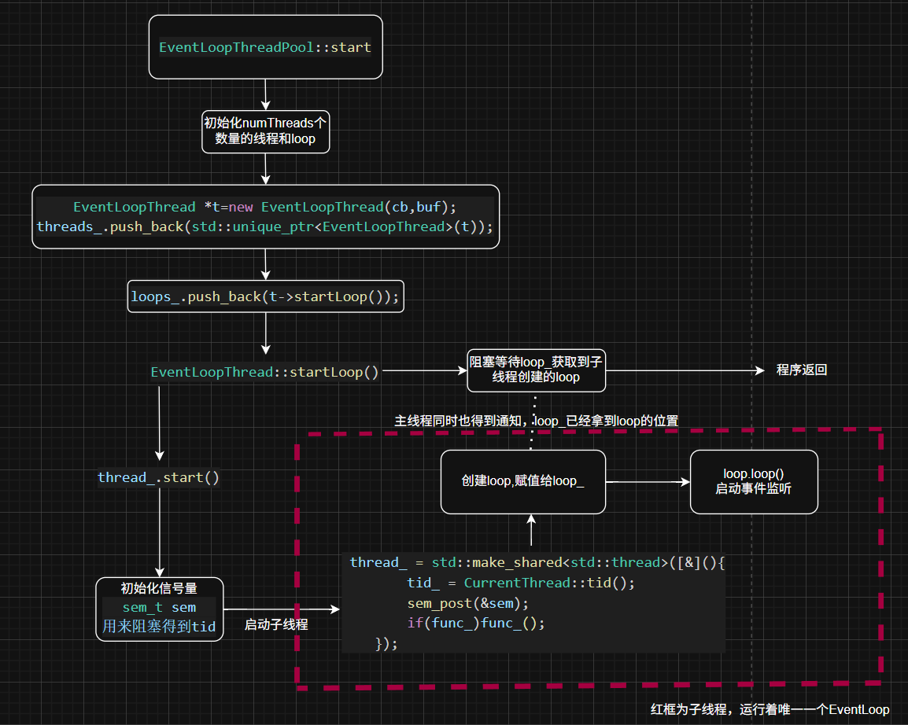


<p align="right"><a href="#万字剖析muduo高性能网络库设计细节">回到顶部⬆️</a></p>

## 六、Tcp通信模块

### 6.1 TcpConnection
1. TcpConnection 封装了与单个客户端进行TCP通信的所有细节
2. 生命周期管理：从连接建立到断开的整个过程。
3. 数据收发：处理套接字上的读写事件，管理输入和输出缓冲区。
4. 事件处理：通过 Channel 对象与 EventLoop 交互，响应套接字上的可读、可写、关闭、错误等事件。
5. 回调机制：提供回调接口（如消息到达、连接建立/断开、数据发送完毕等），将网络事件通知给上层业务逻辑（通常是 TcpServer 或 TcpClient）。
6. 状态管理：维护连接的当前状态（如连接中、已连接、断开中、已断开）。
7. 线程安全：确保其操作在其所属的 EventLoop 线程中执行，以避免多线程问
关键成员变量：
- loop_ (EventLoop*): 指向管理此连接的 EventLoop 对象。所有与此连接相关的操作都必须在这个 loop_ 所在的线程中执行。 CheckLoopNotNull 确保传入的 loop 不为空。
- name_ (const std::string): 连接的名称，通常用于日志和调试。
- state_ (std::atomic<StateE>): 连接的当前状态（如 KConnecting, KConnected, KDisconnecting, KDisconnected）。使用 std::atomic 可能暗示了状态可能从其他线程查询，但修改应在 loop_ 线程中。
- reading_ (bool): 标志是否正在主动读取数据。
- socket_ (std::unique_ptr<Socket>): 封装了连接的套接字文件描述符 (sockfd) 及其相关操作（如 shutdownWrite）。
- channel_ (std::unique_ptr<Channel>): 核心组件。Channel 是套接字文件描述符 (sockfd)  与 EventLoop 之间的桥梁。它负责：
  - 向 EventLoop注册关心的事件（读、写等）。
  - 当 EventLoop 检测到 sockfd 上有事件发生时，调用 Channel 中注册的回调函数。
- localAddr_ (const InetAddress): 本地（服务器）的地址。
- peerAddr_ (const InetAddress): 对等端（客户端）的地址。
- inputbuffer_ (Buffer): 输入缓冲区，用于暂存从套接字读取到的数据。
- outputbuffer_ (Buffer): 输出缓冲区，用于暂存待发送到套接字的数据。
- ConnectionCallback_, MessageCallback_, WriteCompleteCallback_, highWaterMarkCallback_, closeCallback_: 各种回调函数，由上层（如 TcpServer）设置，用于处理连接的不同事件。
- highWaterMark_ (size_t): 输出缓冲区的高水位标记。当待发送数据超过此标记时，会触发 highWaterMarkCallback_


### 6.2 TcpServer
TcpServer 的主要职责是监听指定的端口，接受新的客户端连接，并将这些连接分发给工作线程（如果配置了线程池）进行处理。它管理着服务器的生命周期和所有活动的 TcpConnection

1. 监听与接受连接：通过内部的 Acceptor 对象来监听指定的IP地址和端口，当有新的客户端连接请求到达时，Acceptor 会接受连接并通知 TcpServer。
2. 连接管理：维护一个所有活动 TcpConnection 对象的集合（通常是一个 std::map），并在连接建立和断开时进行相应的添加和移除操作。
3. 线程池集成：可以配置一个 EventLoopThreadPool（线程池），将新接受的连接以某种策略（如轮询）分发给线程池中的某个 EventLoop（即某个工作线程）来处理，实现并发。
4. 回调机制：提供回调接口（如新连接建立、消息到达、连接断开等），将服务器层面的事件通知给上层业务逻辑。
5. 服务器生命周期：控制服务器的启动和停止。
**关键成员变量：**
- loop_ (EventLoop*): 指向服务器主 EventLoop 的指针。这个 EventLoop 通常负责处理监听套接字上的连接请求事件。CheckLoopNotNull 确保传入的 loop 不为空。
- ipPort_ (const std::string): 服务器监听的IP地址和端口号的字符串表示。
- name_ (const std::string): 服务器的名称，用于日志和调试。
- acceptor_ (std::unique_ptr<Acceptor>): 核心组件。Acceptor 封装了服务器监听套接字（listenfd）的创建、绑定、监听以及接受新连接的逻辑。它本身也运行在 loop_（主 EventLoop）中。
- threadPool_ (std::shared_ptr<EventLoopThreadPool>): 指向 EventLoopThreadPool 对象的指针。这个线程池管理着一组工作 EventLoop（即I/O线程），用于处理客户端连接上的数据收发。
- newConnectionCallback_ (ConnectionCallback): 当有新连接成功建立时，TcpServer 会调用此回调。
- MessageCallback_ (MessageCallback): 当某个 TcpConnection 收到数据时，会最终调用此回调。
- WriteCompleteCallback_ (WriteCompleteCallback): 当某个 TcpConnection 的数据发送完毕时，会调用此回调。
- threadInitCallback_ (ThreadInitCallback): 传递给 EventLoopThreadPool，用于在每个工作线程启动其 EventLoop 之前进行初始化。
- connections_ (std::map<std::string, TcpConnectionPtr>): 一个映射表，用于存储所有活动的 TcpConnection。键是连接的名称 (connName)，值是 TcpConnection 的 std::shared_ptr (TcpConnectionPtr)。
- nextConnId_ (int): 用于为新连接生成唯一ID的计数器。
- started_ (std::atomic<int>): 标志服务器是否已经启动，用于防止多次调用 start()

<p align="right"><a href="#万字剖析muduo高性能网络库设计细节">回到顶部⬆️</a></p>


## 七、模块间通信
待更新
<p align="right"><a href="#万字剖析muduo高性能网络库设计细节">回到顶部⬆️</a></p>

## 八、工作流程
待更新
<p align="right"><a href="#万字剖析muduo高性能网络库设计细节">回到顶部⬆️</a></p>

## 九、总结
待更新
<p align="right"><a href="#万字剖析muduo高性能网络库设计细节">回到顶部⬆️</a></p>

## 参考文章
1. https://www.zhihu.com/question/59975081/answer/1932776593
2. 《Linux高性能服务器编程》
3. https://zhuanlan.zhihu.com/p/495016351
<p align="right"><a href="#万字剖析muduo高性能网络库设计细节">回到顶部⬆️</a></p>